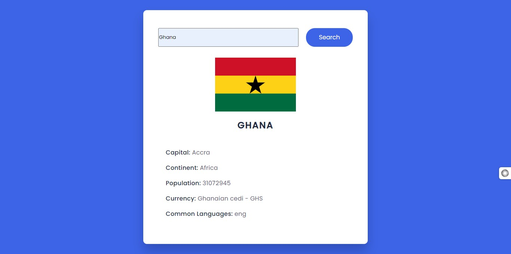

# Country Information Finder

This is a simple web application that allows users to search for information about countries using their names. The application fetches data from the [Rest Countries API](https://restcountries.com/) and displays relevant information about the specified country.

## Features

- **Search by Country Name**: Users can enter the name of a country in the input field and click the search button to retrieve information about that country.
- **Display Information**: Upon successful retrieval of data from the API, the application displays information such as the country's capital, flag, population, currency, and common languages.
- **Error Handling**: If the input field is empty or if there's an error during the fetch request (e.g., invalid country name or network error), appropriate error messages are displayed to the user.

## Usage

To use the application, follow these steps:

1. Open the `index.html` file in a web browser.
2. Enter the name of the country you want to search for in the input field.
3. Click the search button.
4. The application will fetch information about the specified country and display it on the webpage.

## Code Explanation

- The JavaScript code (`script.js`) selects the search button and the input field for the country name using `getElementById`.
- It adds a click event listener to the search button.
- When the search button is clicked, it retrieves the value entered in the country input field.
- It constructs a URL using the entered country name to fetch data from the Rest Countries API.
- It performs a fetch request to the constructed URL.
- Upon receiving the response, it converts the response to JSON format.
- It extracts relevant data such as capital, flag, name, continent, population, currency, and languages from the response.
- It updates the HTML content of a certain element (assuming there's an element with id `result`) with the retrieved data, using template literals.
- If an error occurs during the fetch (for example, if the country name is not valid or the API is down), it catches the error and updates the HTML content to display an appropriate error message.

## Dependencies

This application relies on the Rest Countries API for fetching country information. No additional dependencies are required to run the application.
